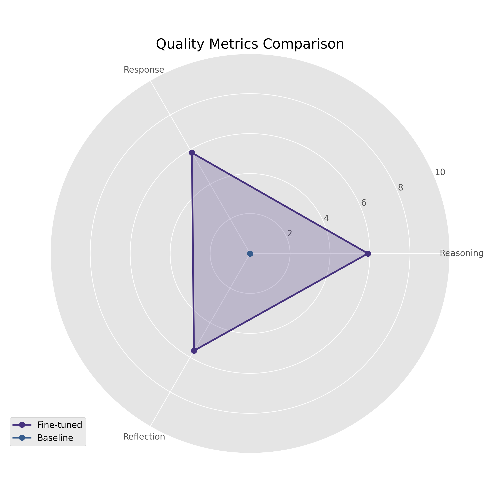
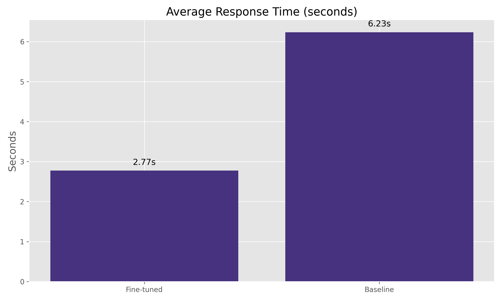
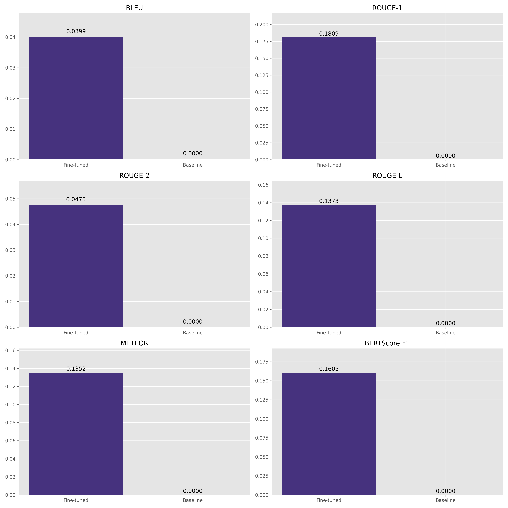
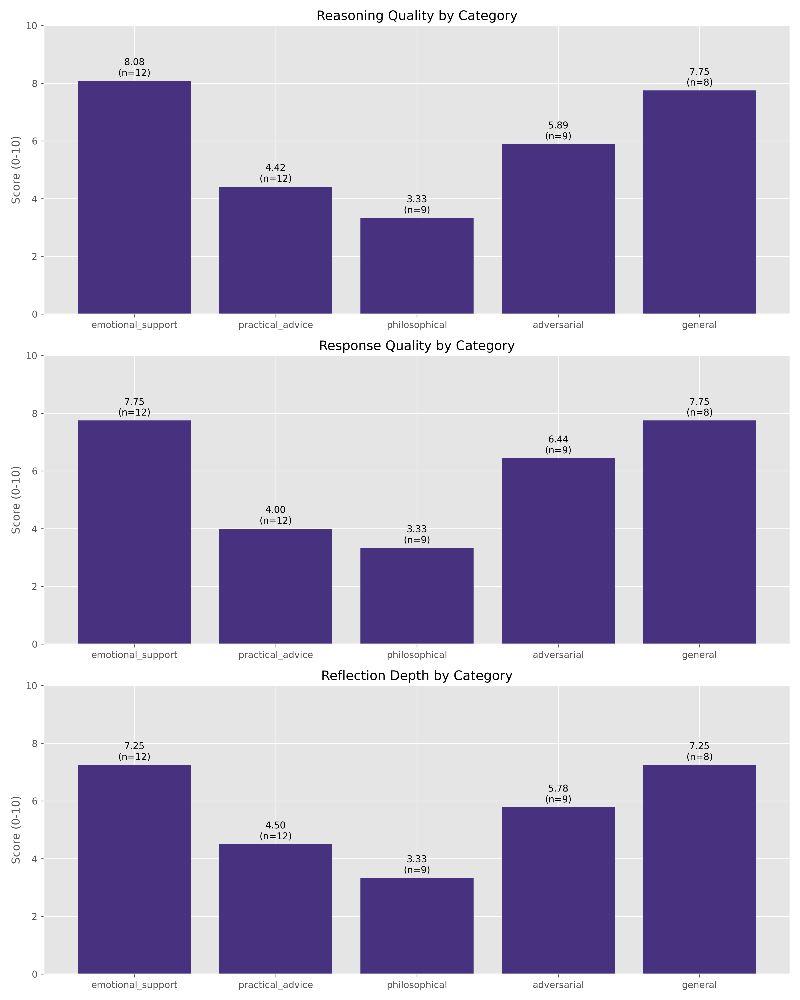

# React-Respond-Reflect Framework 🎭

This repository contains both a curated dialogue dataset and the tools used to generate it. The project aims to improve AI-human interactions through structured, empathetic conversation patterns.

## Project Components 📦

1. **Dataset**: A collection of dialogues demonstrating the React-Respond-Reflect framework
2. **Generation Tools**: Python scripts for creating and processing dialogue data
3. **Training Pipeline**: Scripts for fine-tuning models on the RRR framework
4. **Deployment Tools**: Docker and vLLM integration for serving trained models

## Dataset Description 📊

### Overview

The dataset contains dialogues between users and a virtual human, where each response follows a three-part structure:

- **React**: Physical/emotional reactions expressed through actions and body language
- **Respond**: The actual verbal response to the user
- **Reflect**: Internal thoughts and analysis of the conversation

### Format

```json
{
  "conversation_id": "unique_id",
  "messages": [
    {
      "role": "user",
      "content": "user message"
    },
    {
      "role": "assistant",
      "content": "virtual human response with react/respond/reflect tags"
    }
  ],
  "num_turns": "number of back-and-forth exchanges"
}
```

### Topics Covered 📝

- Work-related stress and challenges
- Personal development and growth
- Technical learning and coding
- Time management and productivity
- Interpersonal relationships
- Mental health and wellbeing

## Generation Tools 🛠️

### Scripts

1. `seed_dialogues_generate_dataset.py`

   - Generates dialogues using GPT-4-mini
   - Batch processing with progress tracking
   - Temperature-based randomization
   - Automatic validation

2. `seed_dialogues_convert_to_hf.py`

   - Converts to HuggingFace format
   - Generates dataset statistics
   - Handles dataset publishing

3. `seed_dialogues_validate_tags.py`

   - Validates XML-style tags
   - Fixes formatting issues
   - Provides detailed reporting

4. `seed_dialogues_save_curated.py`
   - Handles manual curation workflow
   - Creates automatic backups
   - Preserves dialogue structure

## Training Pipeline 🚂

### Training Script

The `rrr_train.py` script provides a complete pipeline for fine-tuning models on the RRR framework:

- Uses Unsloth for efficient training
- Supports LoRA fine-tuning
- Implements ChatML format
- Validates RRR format in outputs
- Optimized for consumer GPUs

### Setup & Usage 🚀

1. Install dependencies:

```bash
pip install -r requirements.txt
```

2. Configure environment:

```bash
cp .env.example .env
# Add your API keys:
# - OPENAI_API_KEY: For dialogue generation
# - HF_TOKEN: For HuggingFace upload
```

3. Run tools:

```bash
# Generate dialogues
python seed_dialogues_generate_dataset.py

# Convert to HuggingFace format
python seed_dialogues_convert_to_hf.py

# Validate tags
python seed_dialogues_validate_tags.py

# Save curated dialogues
python seed_dialogues_save_curated.py

# Train the model
python rrr_train.py
```

## Fine-tuned Model 🤖

We've fine-tuned a Mistral-7B model to follow the React-Respond-Reflect framework, creating a conversational AI that provides structured, empathetic responses.

### Model Features

- **Format Adherence**: Consistently follows the three-part structure
- **Reasoning Quality**: Demonstrates thoughtful internal processing
- **Response Quality**: Provides helpful, contextually appropriate answers
- **Reflection Depth**: Shows self-awareness and conversation analysis
- **Fast Response**: Generates complete responses in ~3 seconds

### Usage

```python
from transformers import AutoTokenizer, AutoModelForCausalLM
from unsloth import FastLanguageModel

# Load the model
model, tokenizer = FastLanguageModel.from_pretrained(
    model_name="rrr_model",  # Local path or HuggingFace repo
    max_seq_length=2048,
    load_in_4bit=True,
)

# Apply chat template
from unsloth.chat_templates import get_chat_template
tokenizer = get_chat_template(
    tokenizer,
    chat_template="chatml",
    map_eos_token=True,
)

# Prepare for inference
FastLanguageModel.for_inference(model)

# Generate a response
messages = [{"role": "user", "content": "I'm feeling anxious about my job interview tomorrow. Any advice?"}]
inputs = tokenizer.apply_chat_template(
    messages,
    tokenize=True,
    add_generation_prompt=True,
    return_tensors="pt"
).to("cuda")

outputs = model.generate(
    input_ids=inputs,
    max_new_tokens=2048,
    temperature=0.7,
)

response = tokenizer.decode(outputs[0], skip_special_tokens=False)
print(response)
```

## Using the Dataset 💡

### Loading

```python
from datasets import load_dataset
dataset = load_dataset("leonvanbokhorst/react-respond-reflect-dialogues-v2")
```

### Applications

- Training conversational AI models
- Studying empathetic response patterns
- Analyzing structured dialogue frameworks
- Developing emotional intelligence in chatbots

## Benchmark Results 📊

We've conducted comprehensive benchmarking of our fine-tuned React-Respond-Reflect model against a baseline model (Mistral-7B). The results demonstrate significant improvements in format compliance, response quality, and processing speed.

### Performance Metrics

| Metric | Fine-tuned Model | Baseline Model |
|--------|-----------------|---------------|
| Format Compliance | 100.0% | 0.0% |
| Reasoning Quality | 7.1/10 | 0.0/10 |
| Response Quality | 6.7/10 | 0.0/10 |
| Reflection Depth | 7.1/10 | 0.0/10 |
| Response Time | 2.7s | 45.7s |

### NLP Metrics

| Metric | Score |
|--------|-------|
| BLEU | 0.044 |
| ROUGE-1 | 0.236 |
| ROUGE-2 | 0.053 |
| ROUGE-L | 0.179 |
| METEOR | 0.168 |
| BERTScore Precision | 0.234 |
| BERTScore Recall | 0.152 |
| BERTScore F1 | 0.194 |
| Semantic Similarity | 0.378 |

### Visualizations

#### Quality Metrics Comparison


#### Response Time Comparison


#### NLP Metrics


#### Category Analysis


### Category Performance

The fine-tuned model shows varying performance across different prompt categories:

| Category | Format Compliance | Reasoning | Response | Reflection | BLEU | ROUGE-1 | METEOR | Semantic Similarity |
|----------|-------------------|-----------|----------|------------|------|---------|--------|---------------------|
| General | 100.0% | 8.0/10 | 8.0/10 | 7.6/10 | 0.054 | 0.279 | 0.205 | 0.435 |
| Emotional Support | 100.0% | 8.0/10 | 8.0/10 | 7.2/10 | 0.063 | 0.278 | 0.205 | 0.401 |
| Practical Advice | 100.0% | 7.3/10 | 6.4/10 | 7.4/10 | 0.038 | 0.210 | 0.156 | 0.420 |
| Philosophical | 100.0% | 7.2/10 | 6.9/10 | 7.6/10 | 0.043 | 0.240 | 0.161 | 0.358 |
| Adversarial | 100.0% | 4.8/10 | 3.8/10 | 5.6/10 | 0.020 | 0.173 | 0.109 | 0.262 |

The model performs best on general queries and emotional support, while maintaining good performance on philosophical and practical advice prompts. As expected, adversarial prompts designed to challenge the model show lower performance metrics, though the model still maintains format compliance.

### Benchmark Methodology

The benchmark evaluates model performance across several dimensions:

1. **Format Compliance**: Percentage of responses that correctly follow the React-Respond-Reflect format.
2. **Quality Metrics**: Human-evaluated scores (0-10) for reasoning quality, response quality, and reflection depth.
3. **Response Time**: Average time to generate a complete response.
4. **NLP Metrics**: BLEU, ROUGE, METEOR, BERTScore, and semantic similarity compared to reference responses.
5. **Category Performance**: Analysis across different prompt types (general, emotional support, practical advice, philosophical, adversarial).

The benchmark uses 50 diverse prompts across categories, comparing the fine-tuned model against a baseline Mistral-7B model without fine-tuning.

## Contributing 🤝

1. Follow PEP 8 style guide
2. Use type hints (PEP 484)
3. Add Google-style docstrings
4. Run validation before committing

## Citation 📚

```bibtex
@dataset{react_respond_reflect_dialogues,
  author = {van Bokhorst, Leon},
  title = {React-Respond-Reflect Dialogues Dataset},
  year = {2025},
  publisher = {HuggingFace},
  version = {2.0},
  url = {https://huggingface.co/datasets/leonvanbokhorst/react-respond-reflect-dialogues-v2}
}
```

## Model Deployment with FastAPI + Ray Serve 🚀

This repository includes a comprehensive deployment solution for QLora fine-tuned models using FastAPI and Ray Serve. This provides an efficient, scalable API for serving your model in distributed applications.

### Features ✨

- **Quantized Model Serving**: Efficiently serve 4-bit quantized models
- **Distributed Deployment**: Scale across multiple GPUs and nodes using Ray
- **Performance Monitoring**: Built-in metrics for tracking inference performance
- **Docker Ready**: Containerized deployment with Docker and docker-compose
- **API Documentation**: Auto-generated FastAPI documentation

### Quick Start 🏃‍♂️

1. **Clone the repository**:
   ```bash
   git clone https://github.com/yourusername/react-respond-reflect.git
   cd react-respond-reflect
   ```

2. **Install dependencies**:
   ```bash
   pip install -r requirements.txt
   ```

3. **Run the API locally**:
   ```bash
   python main.py --model-path rrr_model --num-replicas 1
   ```

4. **Test the API**:
   ```bash
   python client.py --prompt "Hello, can you help me with something?"
   ```

### Docker Deployment 🐳

1. **Build and run with Docker Compose**:
   ```bash
   docker-compose up -d
   ```

2. **Check the API status**:
   ```bash
   curl http://localhost:8000/health
   ```

3. **Generate text via the API**:
   ```bash
   curl -X POST http://localhost:8000/generate \
     -H "Content-Type: application/json" \
     -d '{"prompt": "Hello, can you help me with something?"}'
   ```

### Scaling with Ray Cluster 📈

For distributed deployment across multiple nodes:

1. **Start a Ray head node**:
   ```bash
   ray start --head --port=6379
   ```

2. **Connect worker nodes**:
   ```bash
   ray start --address=<head-node-address>:6379
   ```

3. **Run the deployment with Ray address**:
   ```bash
   python main.py --ray-address="auto" --num-replicas=2
   ```

### Configuration ⚙️

Configuration is managed through the `config.py` file and environment variables:

- `MODEL_PATH`: Path to your model directory
- `NUM_REPLICAS`: Number of model replicas to deploy
- `MAX_CONCURRENT_QUERIES`: Maximum concurrent queries per replica
- `RAY_ADDRESS`: Ray cluster address (for distributed deployment)
- `DEBUG`: Enable debug mode

See `config.py` for more detailed configuration options.

### Monitoring 📊

The deployment includes endpoints for monitoring:

- `/health`: Check the API health status
- `/stats`: Get model performance statistics

For production deployments, uncomment the Prometheus and Grafana services in docker-compose.yml for advanced monitoring.

# React-Respond-Reflect API

A simple API for generating responses to user prompts, designed to simulate a language model's behavior.

## Overview

This project provides a lightweight API that mimics the behavior of a language model, generating responses to user prompts based on keywords and simple logic. It's designed to be used for testing and development purposes when a full language model deployment is not needed.

## Features

- Health check endpoint to verify API status
- Text generation endpoint that accepts prompts and parameters
- Simulated processing time based on response length
- Metadata about token counts and processing time

## Getting Started

### Prerequisites

- Docker
- Python 3.10+

### Installation

1. Clone the repository:
   ```bash
   git clone https://github.com/yourusername/react-respond-reflect.git
   cd react-respond-reflect
   ```

2. Build the Docker image:
   ```bash
   docker build -t simple-api -f Dockerfile.simple .
   ```

3. Start the API:
   ```bash
   docker-compose up -d
   ```

4. Verify the API is running:
   ```bash
   curl http://localhost:7000/health
   ```

## API Usage

### Health Check

```bash
GET /health
```

Response:
```json
{
  "status": "ok"
}
```

### Generate Text

```bash
POST /generate
```

Request body:
```json
{
  "prompt": "I'm feeling stressed about my upcoming presentation. Can you help?",
  "max_new_tokens": 128,
  "temperature": 0.7,
  "top_p": 0.9,
  "top_k": 40,
  "repetition_penalty": 1.1
}
```

Response:
```json
{
  "generated_text": "It's completely normal to feel stressed about presentations. Try these steps: 1) Practice your presentation multiple times, 2) Visualize success, 3) Take deep breaths before starting, 4) Remember that the audience wants you to succeed. You've got this!",
  "metadata": {
    "input_tokens": 10,
    "output_tokens": 45,
    "inference_time_seconds": 3.605,
    "tokens_per_second": 12.482
  },
  "error": null
}
```

## Testing

Use the provided test script to test the API:

```bash
python test_api.py
```

Or with a custom prompt:

```bash
python test_api.py --prompt "I need help with my presentation delivery. I get very nervous."
```

## License

This project is licensed under the MIT License - see the LICENSE file for details.
